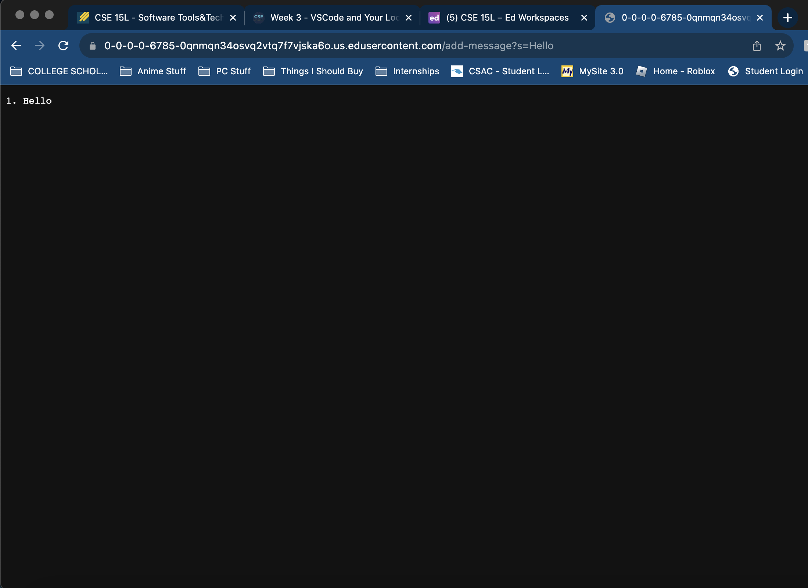
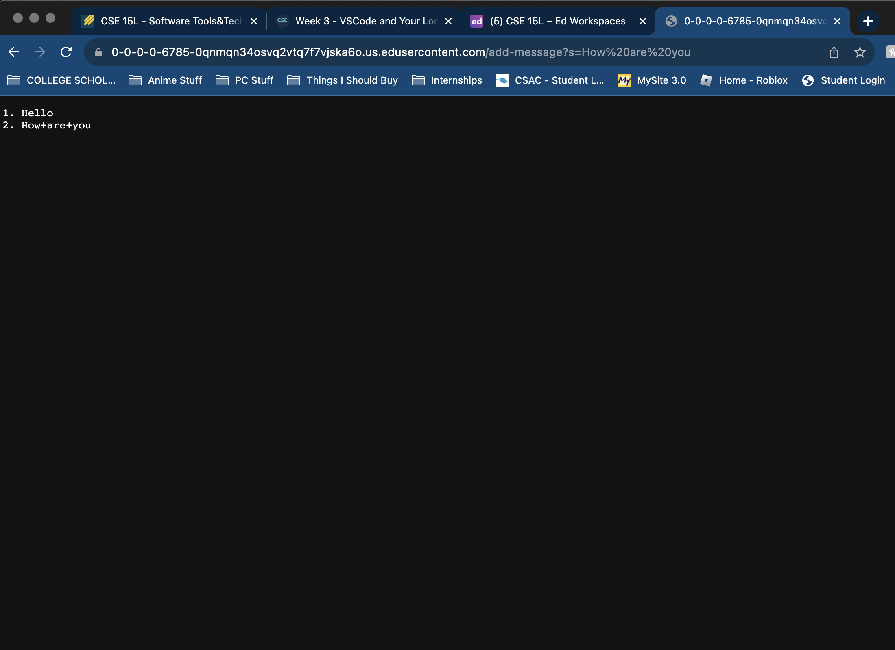

# Lab Report 2


**Part 1**

```
import java.io.IOException;
import java.io.OutputStream;
import java.net.InetSocketAddress;
import java.net.URI;

import com.sun.net.httpserver.HttpExchange;
import com.sun.net.httpserver.HttpHandler;
import com.sun.net.httpserver.HttpServer;

interface URLHandler {
    String handleRequest(URI url);
}

class ServerHttpHandler implements HttpHandler {
    URLHandler handler;
    ServerHttpHandler(URLHandler handler) {
      this.handler = handler;
    }
    public void handle(final HttpExchange exchange) throws IOException {
        // form return body after being handled by program
        try {
            String ret = handler.handleRequest(exchange.getRequestURI());
            // form the return string and write it on the browser
            exchange.sendResponseHeaders(200, ret.getBytes().length);
            OutputStream os = exchange.getResponseBody();
            os.write(ret.getBytes());
            os.close();
        } catch(Exception e) {
            String response = e.toString();
            exchange.sendResponseHeaders(500, response.getBytes().length);
            OutputStream os = exchange.getResponseBody();
            os.write(response.getBytes());
            os.close();
        }
    }
}

public class Server {
    public static void start(int port, URLHandler handler) throws IOException {
        HttpServer server = HttpServer.create(new InetSocketAddress(port), 0);

        //create request entrypoint
        server.createContext("/", new ServerHttpHandler(handler));

        //start the server
        server.start();
        System.out.println("Server Started!");
    }
}

class Handler implements URLHandler{
    String str = "";
    int num = 0;
    public String handleRequest(URI url) {
        if (url.getPath().contains("/add-message")) {
            String[] parameters = url.getQuery().split("=");
            if (parameters[0].equals("s")){
                num++;
                str += num + ". " + parameters[1] + "\n";   
                return str;
            }
            else{
                return "incorrect query";
            }                  
        }
        else{
            return "incorrect path";
        }       
    }
}

class StringServer {
    public static void main(String[] args) throws IOException {
        if(args.length == 0){
            System.out.println("Missing port number! Try any number between 1024 to 49151");
            return;
        }
        int port = Integer.parseInt(args[0]);
        Server.start(port, new Handler());
    }
}
```


 \
The method that was called was the handleRequest method.\
The argument for this method is the URL of the server.\
There are two relevant fields to the method: str and num.\
The values of these two are "" and 0, respectively.\
After calling the method, the fields' values changed to "1. Hello\n" and 1, respectively.


 \
The method that was called was the handleRequest method.\
The argument for this method is the URL of the server.\
There are two relevant fields to the method: str and num.\
The values of these two are "1. Hello\n" and 1, respectively.\
After calling the method, the fields' values changed to \
"1. Hello\n 2. How are you\n" and 2, respectively.

**Part 2**


**Part 3** \
Something that I learned in Week 2 and Week 3 is how to run a server on a local computer.\
After logging into a remote computer, we have to run code that allows us to run a server like\
the code mentioned in Part 1. We have to run a server that runs on an individual port in order\
in case multiple people try to connect to the same port on the same local computer.\
After starting the server, we can access it from any other computer.
