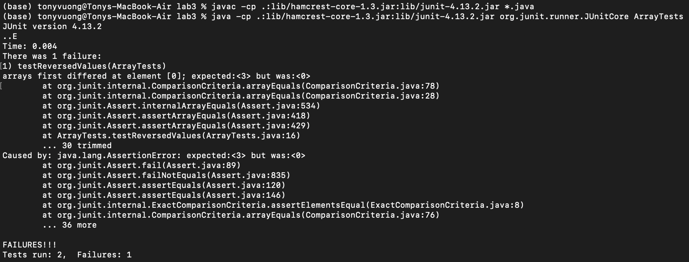

# Part 1 - Bugs
## Failing-Inducing Input:
```
 static int[] reversed(int[] arr) {

    int[] newArray = new int[arr.length];
    
    for(int i = 0; i < arr.length; i += 1) {
      newArray[arr.length - i - 1] = arr[i];
    }
    return newArray;
  }

  @Test
  public void testReversedValues(){
    int[] input1 = {1, 2, 3};
    assertArrayEquals(new int[]{3, 2, 1}, ArrayExamples.reversed(input1));
  }

```
## Input That Doesn't Produce Failure:
```
 static int[] reversed(int[] arr) {

    int[] newArray = new int[arr.length];
    
    for(int i = 0; i < arr.length; i += 1) {
      newArray[arr.length - i - 1] = arr[i];
    }
    return newArray;
  }

  @Test
  public void testReversedValues(){
    int[] input1 = {null};
    assertArrayEquals(new int[]{null}, ArrayExamples.reversed(input1));
  }

```
## Symptom:

## Bug:
**Before**
```
  static int[] reversed(int[] arr) {

    int[] newArray = new int[arr.length];
    
    for(int i = 0; i < arr.length; i += 1) {
      arr[i] = newArray[arr.length - i - 1];
    }
    return newArray;
  }
```
**After**
```
  static int[] reversed(int[] arr) {

    int[] newArray = new int[arr.length];
    
    for(int i = 0; i < arr.length; i += 1) {
      newArray[arr.length - i - 1] = arr[i];
    }
    return newArray;
  }
```
The fix addresses the bugs because the method is trying to reverse the new array created in the method which doesn't\
contain any elements rather than the array we are trying to reverse.

# Part 2 - Researching Commands

## -e Command Line Option 

**Command** 
```
$ less -e find-results.txt
``` 
**Output**
```
technical/911report
technical/911report/chapter-1.txt
technical/911report/chapter-10.txt
technical/911report/chapter-11.txt
technical/911report/chapter-12.txt
technical/911report/chapter-13.1.txt
technical/911report/chapter-13.2.txt
technical/911report/chapter-13.3.txt
technical/911report/chapter-13.4.txt
technical/911report/chapter-13.5.txt
technical/911report/chapter-2.txt
technical/911report/chapter-3.txt
technical/911report/chapter-5.txt
technical/911report/chapter-6.txt
technical/911report/chapter-7.txt
technical/911report/chapter-8.txt
technical/911report/chapter-9.txt
technical/911report/preface.txt
find-results.txt (END)
```
Using the -e command line on a file allows us to run the less command normally, but automatically exits once the end of the file is read by simply pressing another button rather than specifically pressing q to quit. 

**Command** 
```
$ less -E technical/911report
```
**Output**
```
technical/911report is a directory
```
Using the -e command line on a directory is the same as using just the `less` command. Since the argument is not a file, it just says that the path is a directory. <br>
<br>
Source: https://phoenixnap.com/kb/less-command-in-linux <br>
<br>

## -N Command Line Option

**Command** 
```
$less -N find-results.txt
```

**Output** 
```
      1 technical/911report
      2 technical/911report/chapter-1.txt
      3 technical/911report/chapter-10.txt
      4 technical/911report/chapter-11.txt
      5 technical/911report/chapter-12.txt
      6 technical/911report/chapter-13.1.txt
      7 technical/911report/chapter-13.2.txt
      8 technical/911report/chapter-13.3.txt
      9 technical/911report/chapter-13.4.txt
     10 technical/911report/chapter-13.5.txt
     11 technical/911report/chapter-2.txt
     12 technical/911report/chapter-3.txt
     13 technical/911report/chapter-5.txt
     14 technical/911report/chapter-6.txt
     15 technical/911report/chapter-7.txt
     16 technical/911report/chapter-8.txt
     17 technical/911report/chapter-9.txt
     18 technical/911report/preface.txt
find-results.txt (END)
```
Using the -N command line on a file allows us to run the less command normally, but adds numbers for each line in the file.

**Command** 
```
$ less -N technical/911report
```
**Output**
```
technical/911report is a directory
```
Using the -e command line on a directory is the same as using just the `less` command. Since the argument is not a file, it just says that the path is a directory. <br>
<br>
Source: https://phoenixnap.com/kb/less-command-in-linux <br>
<br>

## -f Command Line Option

**Command** 
```
$less -f find-results.txt
```

**Output** 
```
      1 technical/911report
      2 technical/911report/chapter-1.txt
      3 technical/911report/chapter-10.txt
      4 technical/911report/chapter-11.txt
      5 technical/911report/chapter-12.txt
      6 technical/911report/chapter-13.1.txt
      7 technical/911report/chapter-13.2.txt
      8 technical/911report/chapter-13.3.txt
      9 technical/911report/chapter-13.4.txt
     10 technical/911report/chapter-13.5.txt
     11 technical/911report/chapter-2.txt
     12 technical/911report/chapter-3.txt
     13 technical/911report/chapter-5.txt
     14 technical/911report/chapter-6.txt
     15 technical/911report/chapter-7.txt
     16 technical/911report/chapter-8.txt
     17 technical/911report/chapter-9.txt
     18 technical/911report/preface.txt
find-results.txt (END)
```
Using the -f command line on a file allows us to run the less command normally.

**Command** 
```
$ less -f technical/911report
```
**Output**
```
read error  (press RETURN)


technical/911report (END)
```
Using the -f command line on a directory forces less to be used on a directory. Since it isn't a file, an error is output<br>
<br>
Source: https://phoenixnap.com/kb/less-command-in-linux <br>
<br>

## -F Command Line Option

**Command** 
```
$less -F find-results.txt
```

**Output** 
```
technical/911report
technical/911report/chapter-1.txt
technical/911report/chapter-10.txt
technical/911report/chapter-11.txt
technical/911report/chapter-12.txt
technical/911report/chapter-13.1.txt
technical/911report/chapter-13.2.txt
technical/911report/chapter-13.3.txt
technical/911report/chapter-13.4.txt
technical/911report/chapter-13.5.txt
technical/911report/chapter-2.txt
technical/911report/chapter-3.txt
technical/911report/chapter-5.txt
technical/911report/chapter-6.txt
technical/911report/chapter-7.txt
technical/911report/chapter-8.txt
technical/911report/chapter-9.txt
technical/911report/preface.txt
(base) tonyvuong@Tonys-MacBook-Air docsearch % 
```
Using the -F command line on a file allows us to run the less command normally, but it automatically exited as the contents 
of the file were able to fit onto the screen.

**Command** 
```
$ less -F technical/911report
```
**Output**
```
technical/911report is a directory
```
Using the -F command line on a directory is the same as using just the `less` command. Since the argument is not a file, it just says that the path is a directory. <br>
<br>
Source: https://phoenixnap.com/kb/less-command-in-linux <br>
<br>


