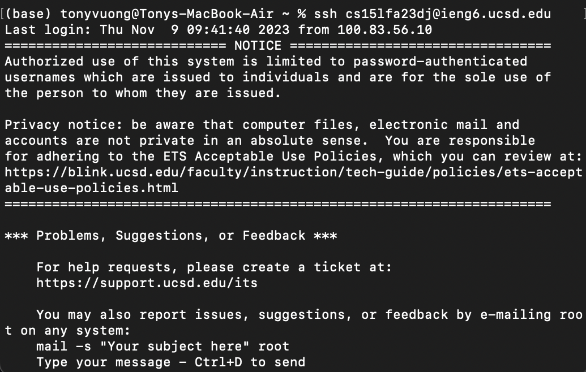
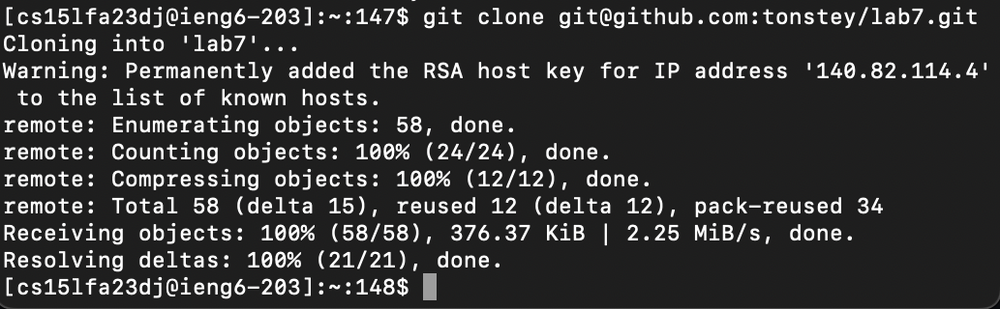
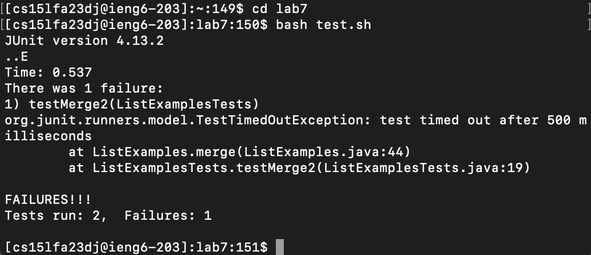
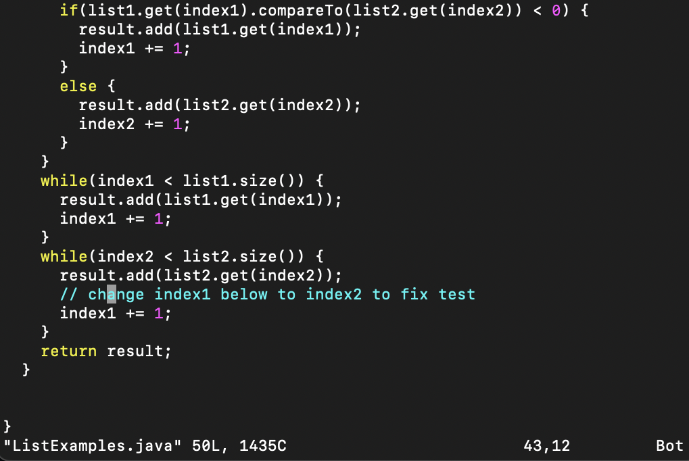
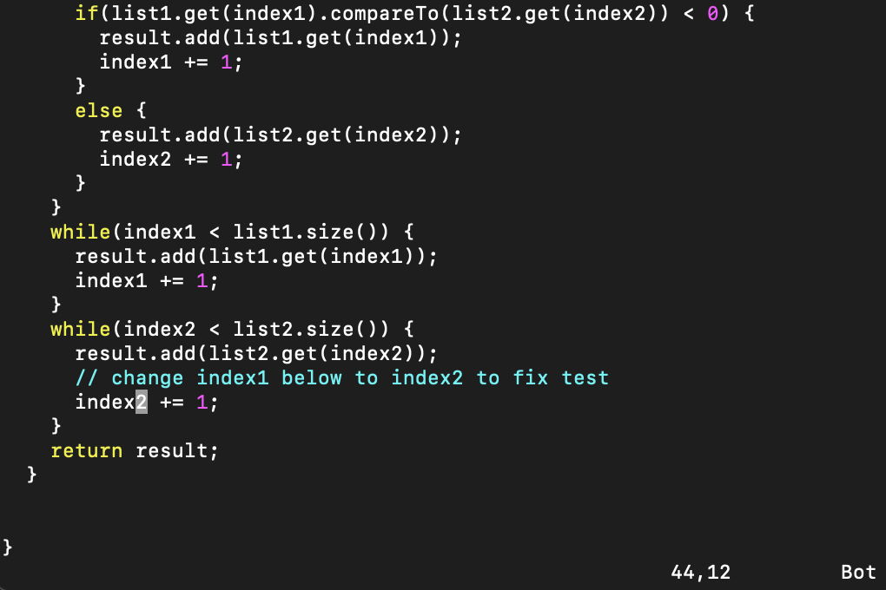
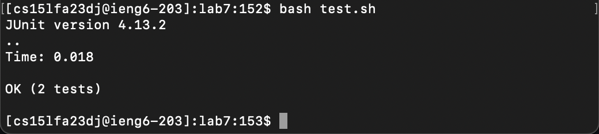
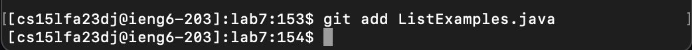
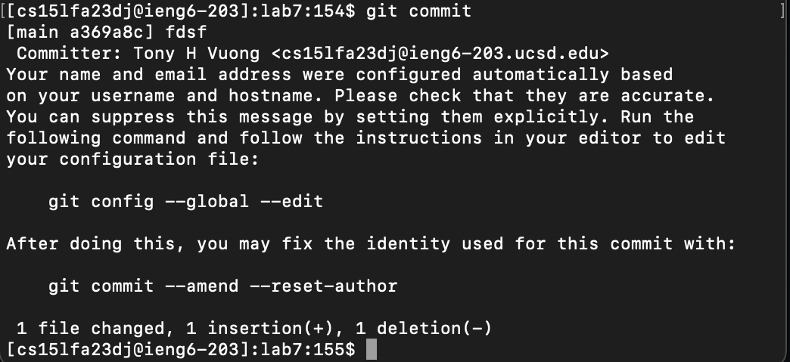
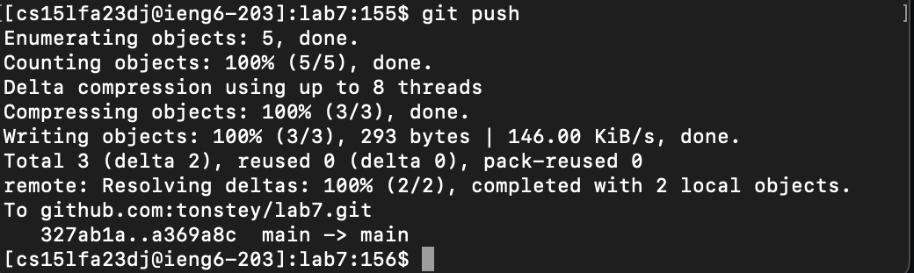

# Lab 4

## Step 4

**Command Run:**
```ssh cs15lfa23dj@ieng6.ucsd.edu```
**Keys Pressed:** 
This command was manually typed in.


## Step 5

**Command Run:**
```git clone ```
**Keys Pressed:** 
<up><up><up><up><up><up><up><up><up><up><enter> \
I searched through the bash history 10 commands up and pressed enter to run it.

## Step 6

**Commands Run:**
```cd lab7```
**Keys Pressed:** 
This command was manually typed in.
```bash test.sh```
**Keys Pressed:**
<up><up><up><up><up><up><up><enter> \
I searched through the bash history, so I pressed up 7 times to view the recent call of bash and pressed enter to run it.

## Step 7

```vim ListExamples.java```
**Keys Pressed:**
<up><up><up><up><up><up><up><up><up><up><up><enter> \
I searched through the bash history 11 commands up and pressed enter to run the command.


**Keys Pressed to Edit:**
I pressed <j> to lower the cursor by 1 line. Then, I pressed <x> to remove the character '1' from 'index1'. \
Then I pressed \<i> to go into insert mode. Finally, I pressed <2> to replace the '1' and pressed 'esc' to go to \
normal mode. To exit, I will press <:>\<w>\<q><!><enter> to save and exit the file.


## Step 8

```bash test.sh```
**Keys Pressed:**
<up><up><enter> \
I searched through the bash history 2 commands up and pressed enter to run the command.


## Step 9


```
git add ListExamples.java
```
**Keys Pressed:**
<up><up><up><up><up><up><up><up><up><up><up><enter> \
I searched through the bash history 11 commands up and pressed enter to run it.


```
git commit
```
**Keys Pressed:**
<up><up><up><up><up><up><up><up><up><up><up><enter> \
I searched through the bash history 11 commands up and pressed enter to run it.
To insert the commit message, I pressed \<i>, then inputted a message of my choice, \
pressed <esc> to enter normal mode, and pressed <:>\<w>\<q><!><enter> to save the message and exitted.


```
git push
```
**Keys Pressed:**
<up><up><up><up><up><up><up><up><up><up><up><enter> \
I searched through the bash history 11 commands up and pressed enter to run it.
