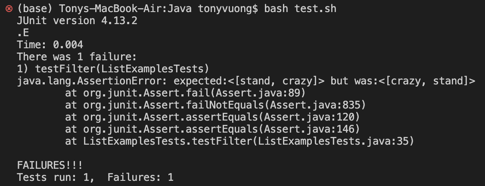

# Lab Report 5 - Putting it All Together

## Part 1 - Debugging Scenario
**Student**: 
I am trying to figure out what the problem with the following code is:


It seems that this code does not have the desired order of each array element. \
Could it possibly happen from how the string checker is called?


**TA**: 
Hi Student, it seems that the order of the array is reversed! See how you're inserting \
each element if stringChecker returns true.

**Student**: 
Thank you, TA! I was able to figure out what the bug/failure-inducing input was. It was an error from the filter method! \
For each string that contained "a", I sent it to the beginning of the array instead of appending it. Thank you for your help!

**Information** \
File & Directory: 
- Java (Directory)
- ListTestExamples.java (Files)
- test.sh (Files)


Code: 
```
import static org.junit.Assert.*;
import org.junit.*;
import java.util.*;
import java.util.ArrayList;

interface StringChecker { boolean checkString(String s); }

class ListExamples {

  static List<String> filter(List<String> list, StringChecker sc) {
    List<String> result = new ArrayList<>();
    for(String s: list) {
      if(sc.checkString(s)) {
        result.add(0, s);
      }
    }
    return result;
  }
}


class HasA implements StringChecker {
    public boolean checkString(String s){
        return s.contains("a");
    }
}


public class ListExamplesTests {
	@Test
	public void testFilter() {
    	List<String> l1 = new ArrayList<String>(Arrays.asList("stand", "crazy", "hour"));
		List<String> l2 = ListExamples.filter(l1, new HasA());
        List<String> check = new ArrayList<String>(Arrays.asList("stand", "crazy"));
		assertEquals(check, l2);
	}
}
```


Commands Run: \
```bash test.sh```

Edit: \
Editted ```result.add(0, s)``` to ```result.add(s)```


## Part 2 - Reflection
I think that one of the most interesting things that I learned this quarter was Vim. I think that with the \
knowledge of using this program, I can do anything with just the use of a terminal. I think that this \
lesson was definitely interesting and liked how it was the whole premise of Skill Demo 4. I am really \
glad that that was part of the curriculum this quarter!
